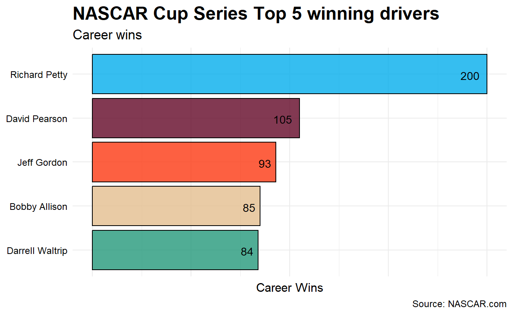
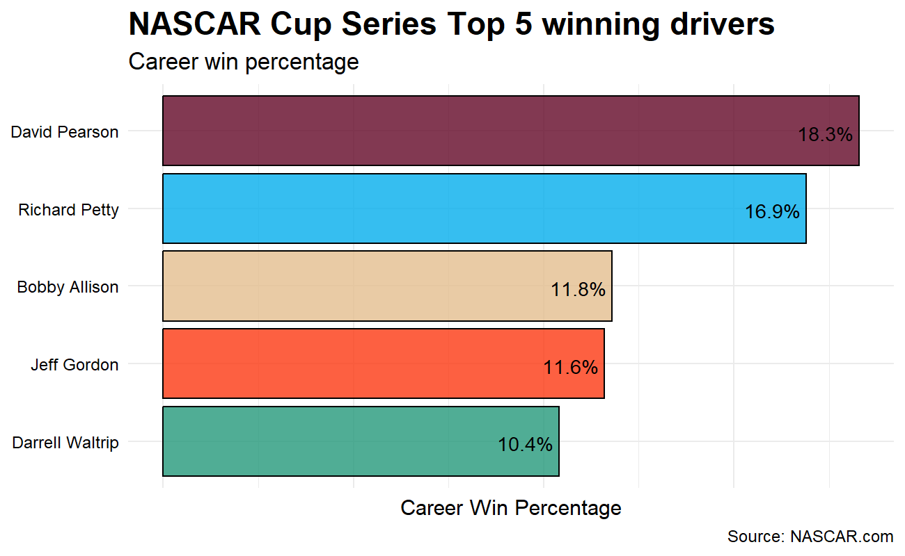
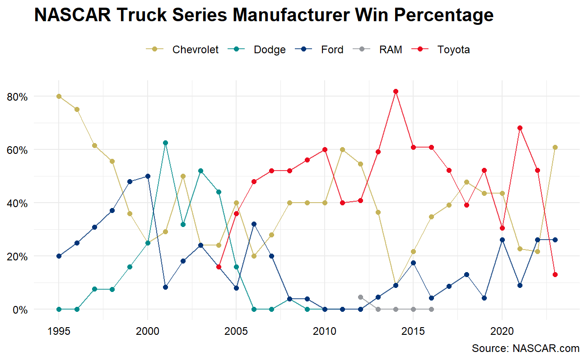
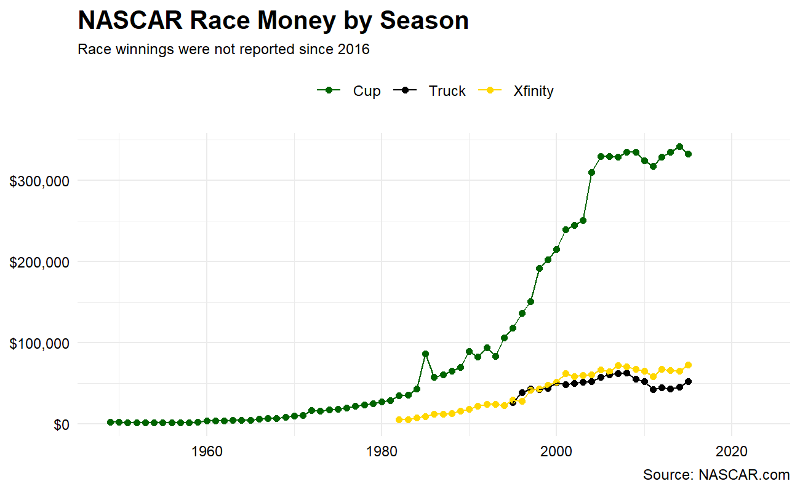

# nascaR.data


----

**nascaR.data** is a curated group of datasets across NASCAR's top three series: Cup, Xfinity, and Trucks. There are 21 sets available to explore & use for creating tables or other data visualizations.

Install `nascaR.data` with the official CRAN release:

```
install.packages('nascaR.data')
```
```
remotes::install_cran('nascaR.data')
```

Or you can install the development verion that contains more-frequently updated race results:

```
remotes::install_github('kyleGrealis/nascaR.data')
```


----

This package is a collection of NASCAR race, driver, owner and manufacturer data across the three major NASCAR divisions: NASCAR Cup Series, NASCAR Xfinity Series, and NASCAR Craftsman Truck Series. The curated data begins with the 1949 season and extends through the end of the 2023 season. Data was sourced with permission from DriverAverages.com.

----

## In the Pits

NASCAR is one of the top-tier racing sports in North America and competes against F1 and IndyCar for the top viewership spot. Approximately 3.22 million people watch a race on any given weekend throughout the season. The `nascaR.data` package is the result of wanting to share a passion for the sport and provide an option to the typical go-to packages when learning new data visualization tools. 

`nascaR.data` is packed full of NASCAR results dating back to the first Daytona Beach race in 1949! Use this package to discover race trends across the NASCAR Cup Series, Xfinity Series, and Craftsman Truck Series. Answer fun questions like "which driver has accumulated the most wins overall?", "which owner has the best top 10 percentage at Daytona?", or see which manufacturer has dominated which series in a certain season. It's all here, so let's strap in to our race seats, fire up those engines, and let's take some warm-up laps.

## Warming up the tires

`nascaR.data` provides access to 21 different datasets (7 per series) and are broken down by overall race results and driver, owner, and manufacturer season & career records. Let's check our gauges and see what's under the hood:

```{r, echo=TRUE}
library(nascaR.data)
```

Use `?nascaR.data::cup_race_data` to view a list of variable descriptions. This package has been designed to swap `cup` for `xfinity` or `truck` to see the same data structure (variables) for the respective series. Would you rather inspect driver-specific results listed by season or their overall career? No problem... this is an easy pit stop: `cup_driver_career` or `xfinity_owner_season` or `truck_mfg_overall`.

## Green Flag!

**Which drivers are in the Top 5 for wins in the NASCAR Cup Series?**

First, organize the drivers in descending order by win. Then, subset to keep the Top 5 winningest drivers. Lastly, feed the data into a horizontal bar chart (some other tweaks will be applied to enhance the visual output).

```{r, echo=TRUE, eval=FALSE, warning=FALSE}
cup_driver_career |>
  arrange(desc(career_wins)) |>
  slice_head(n = 5) |>
  ggplot(aes(driver, career_wins)) +
  geom_bar(stat = 'identity') +
  coord_flip()
```



Wow! This doesn't even look like a close race. Richard Petty clearly leads the field with 200 wins. However, let's take a drive a little deeper into the turn and account for the number of races each driver competed in. What if we compare these same five drivers by win percentage?

```{r, echo=TRUE, eval=FALSE, warning=FALSE}
cup_driver_career |>
  arrange(desc(career_wins)) |>
  slice_head(n = 5) |>
  ggplot(aes(driver, career_win_pct)) +
  geom_bar(stat = 'identity') +
  coord_flip()
```



## The Garage Area

**Which manufacturer has the best win percentage by season?**

Let's go behind the pits and see what the manufacturers are up to in the Truck Series.

```{r, eval=FALSE, warning=FALSE}
truck_mfg_season |>
  ggplot(aes(season, mfg_season_win_pct, group = manufacturer, color = manufacturer)) +
  geom_line() +
  geom_point()
```



No clear trend emerges, though it appears that there may be a 5-year clustering of winning percentage. For example, the Dodges experienced success in the early 2000s, but started to fall off before exiting the series. And while Ford has seemingly had gradual improvement, you can clearly see the success of the Toyota camp since joining the Truck series in 2004.

## Post-race

**Collect your race winnings**

How has the average money for winning a race changed over time?

```{r, eval=FALSE,, warning=FALSE}
cup <- cup_race_data |>
  mutate(series = 'Cup') |>
  filter(finish == 1) |>
  select(season, race, finish, money, series)

xfinity <- xfinity_race_data |>
  mutate(series = 'Xfinity') |>
  filter(finish == 1) |>
  select(season, race, driver, money, series)

truck <- truck_race_data |>
  mutate(series = 'Truck') |>
  filter(finish == 1) |>
  select(season, race, driver, money, series)

bind_rows(cup, xfinity, truck) |>
  group_by(series, season) |>
  summarize(mean_money = mean(money, na.rm = TRUE)) |>
  ggplot(aes(season, mean_money, group = series, color = series)) +
  geom_point() +
  geom_line()
```



Race winnings in the Cup series experienced exponential growth beginning in the 1980s while Xfinity and Truck Series winnings have remained relatively the same since 2000.

## The Backstretch

I hope this gives you a little taste of what is included in this package. There's plenty of opportunity to further clean and reshape the data for data visualizations or model prepping. I'll be adding more data throughout the season.
